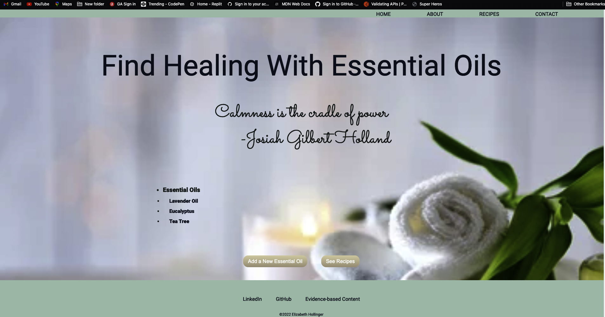

# Find Healing with EssentialOils #

This app allows the users to log essential oils and associated data, and create and store essential oil recipes.  It is designed for naturopathic physicians, integrative physicians, massage therapists and others in the health and beauty fields.

## Background of Essential Oils ##

-Essential Oils have been used for centuries in many cultures around the world for their pathogenic and healing effects. More recently, their popularity has increased as an alternative to traditional practices (https://www.ncbi.nlm.nih.gov/pmc/articles/PMC5694587/).  
       
       *Known use as early as 4500 BC by the ancient Egyptians in salves and cosmetics.
       
       *Also known to be used in Chinese and Indian medicine between 3000 and 2000 BC. Later used by Greeks around 500 BC.
       

       * “In the 18th and 19th centuries, chemists documented the active components of medicinal plants and identified many substances such as caffeine, quinine, morphine, and atropine, which were considered to play an important role in their biological effects In the 18th and 19th centuries, chemists documented the active components of medicinal plants and identified many substances such as caffeine, quinine, morphine, and atropine, which were considered to play an important role in their biological effects” (https://www.ncbi.nlm.nih.gov/pmc/articles/PMC5694587/). 

## Screenshots ##

## Technologies Used ##
MONGODB
Postman
EJS
Mongoose
JavaScript
HTML
CSS

## Getting Started ##

## Future Enhancements ##
*Have a login feature for users
*Use a scroll feature as the item list becomes longer

